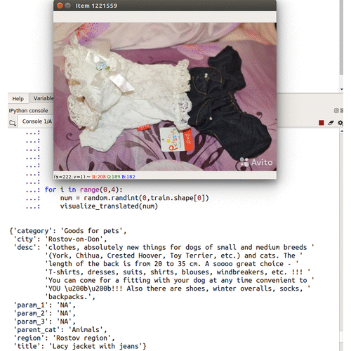

# Ad Demand
Predicting demand for an ad based on its full description (Russian Text Data, Ad Images), its context (Location, Similar Ads) and historical demand.

Dataset: https://www.kaggle.com/c/avito-demand-prediction

## Motivation
1. This dataset contains multiple types of data - numeric, textual, images and time series. It will be interesting to learn how    to train a model to utilize features from such different types of data.
2. The textual data is Russian (foreign to me) and will provide unique challenge during data exploration.

Few of the images from training set and their translated text from Russian can be found below:

## Work in Progress 
- [x] Web Scrapping Population of Cities from Wikipedia
- [x] Data Visualization
- [ ] Data Cleaning - Esp. description column
- [ ] Feature Engineering
- [ ] Data Modelling
- [ ] Evaluation
